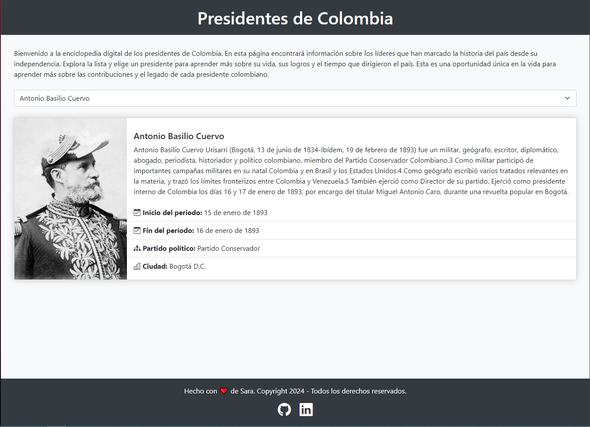

# 📚 Enciclopedia de Presidentes Colombianos

## 📝 Descripción

Este proyecto ofrece una interfaz web interactiva para explorar información detallada sobre los presidentes de Colombia. Utilizando datos consumidos de la API `https://api-colombia.com`, los usuarios pueden visualizar una lista completa de los presidentes. Al seleccionar un presidente específico, se realiza una nueva petición a la API para recuperar y mostrar datos más detallados sobre el presidente elegido, como su período en el cargo, partido político, y una breve descripción de su legado.

## 💻 Tecnologías Utilizadas

El proyecto se ha desarrollado utilizando las siguientes tecnologías:

- **TypeScript**: 📘 Utilizado para escribir el código de la aplicación, aprovechando las ventajas de un lenguaje tipado para mejorar la mantenibilidad y escalabilidad del código.
- **jQuery**: 💡 Empleado para simplificar la manipulación del DOM, manejo de eventos, y las llamadas AJAX para consumir la API.
- **Bootstrap**: 🎨 Framework CSS utilizado para acelerar el desarrollo de la interfaz de usuario, asegurando un diseño responsivo y atractivo sin sacrificar la usabilidad en diferentes dispositivos.

## 🚀 Instrucciones para Ejecutar el Proyecto

Para ejecutar el proyecto en tu entorno local, sigue estos pasos:

1. **Instalación de Dependencias**: 🔧
   
   Primero, necesitas instalar las dependencias del proyecto, incluyendo TypeScript y los tipos de declaración para jQuery, si se utilizan. Abre una terminal en el directorio raíz del proyecto y ejecuta:

   ```sh
   npm install
   ```

2. **Transpilación del Código TypeScript**: ⚙️

   Una vez instaladas las dependencias, puedes transpilar el código TypeScript a JavaScript para que pueda ser ejecutado por los navegadores. Utiliza el siguiente comando para iniciar el proceso de compilación:

   ```sh
   npm run build
   ```

   Este comando convertirá el código TypeScript del directorio src al JavaScript equivalente en el directorio dist (o el que hayas configurado).

3. **Servir el Proyecto**: 🌐
   
   Para visualizar el proyecto, necesitas servir el archivo index.html y los archivos asociados a través de un servidor HTTP. Puedes hacer esto utilizando una extensión de tu IDE, como Live Server en Visual Studio Code, o mediante una herramienta de línea de comandos como http-server que puedes instalar vía npm:

   ```sh
   npm install -g http-server
   ```

   Luego, navega al directorio donde se encuentre tu index.html y ejecuta:

   ```sh
   http-server
   ```

   Sigue las instrucciones en la terminal para acceder al proyecto desde tu navegador.